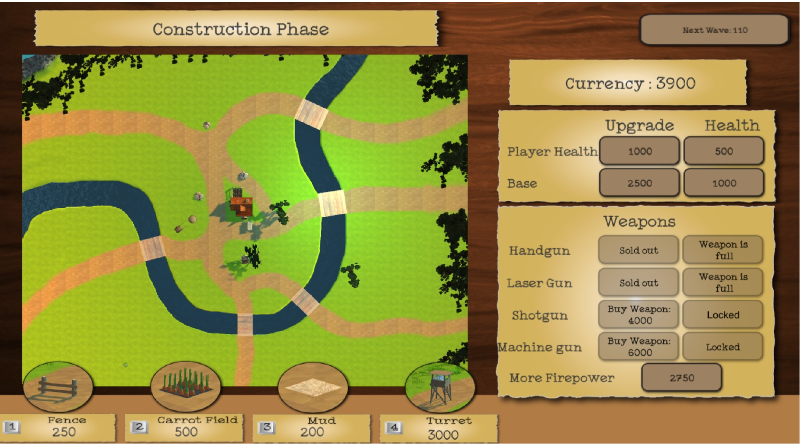
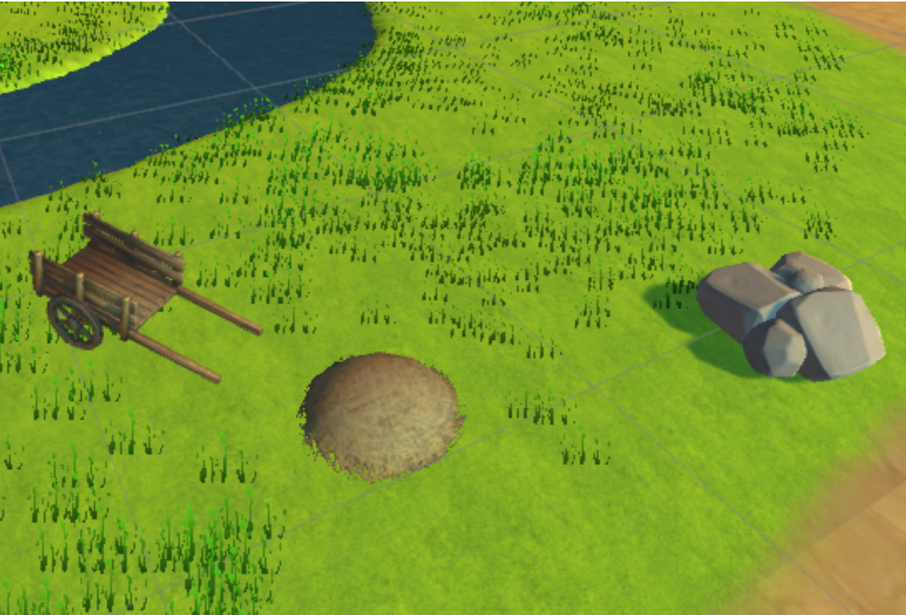
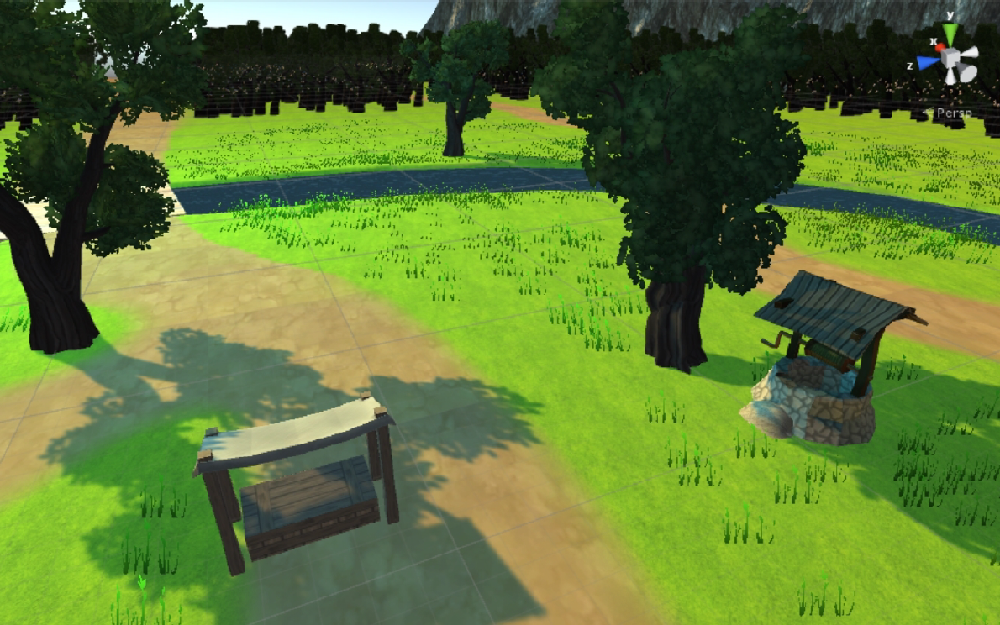
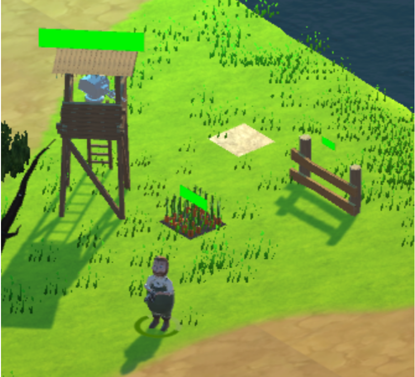
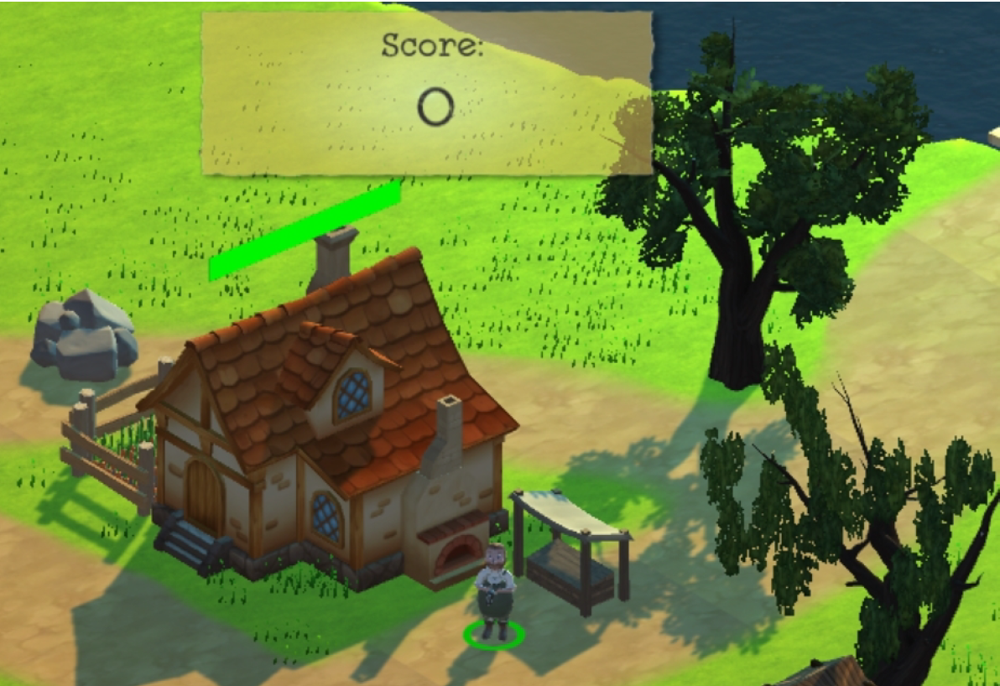
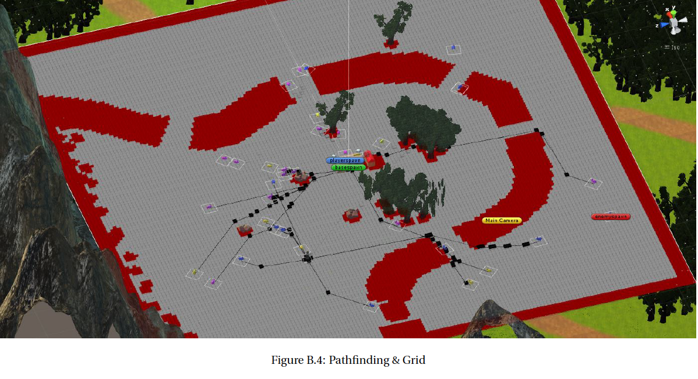

# BBBBBBBBBBBBB
Building a Game from Scratch 

Together with five other students, we designed a game to conclude the Minor: Software Design & Application. All of us did not have any experience of creating a game beforehand, but during the minor we gathered the basic object-oriented programming skills to do so.

 

 <!---
Time-lapse of development of the game: 
!
-->
